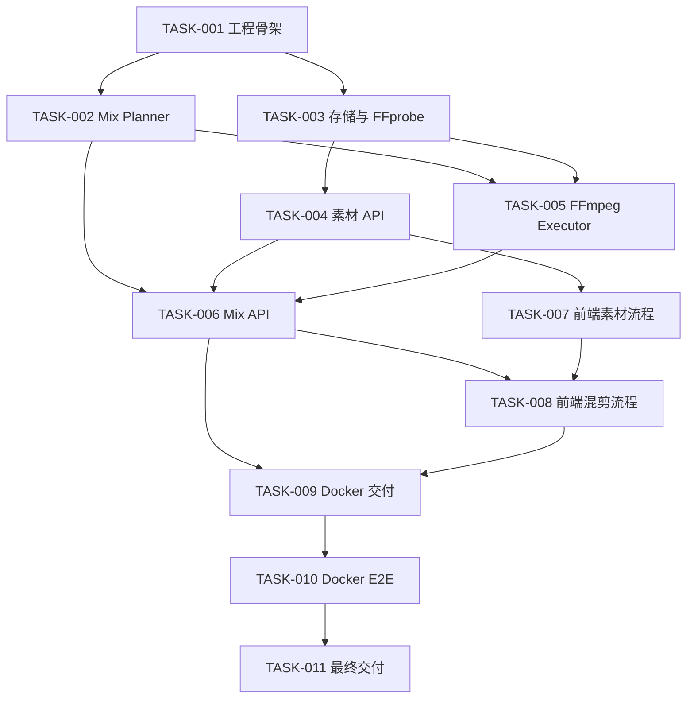

# ClipWeaver 开发任务

本文档是开发任务状态的唯一入口。所有任务首先受 [原始需求基线](../requirements-baseline.md) 约束，再受 [technical-design.md](../technical-design.md) 约束；任务卡只负责定义可执行范围、依赖、交付物和验收证据。任务卡不得削弱需求基线。

## 状态模型

每个任务只能处于以下状态之一：

- `TODO`：依赖尚未全部通过，或尚未开始。
- `IN_PROGRESS`：依赖均已 `PASS`，当前正在实施。
- `BLOCKED`：实施过程中遇到明确阻塞，必须在任务卡“验收证据”末尾追加阻塞原因、影响范围和恢复条件。
- `REVIEW`：实现已完成，验收命令已执行，等待复核。
- `PASS`：所有验收项均通过，证据已记录，可以作为后续任务的前置条件。

状态流转：

```text
TODO → IN_PROGRESS → REVIEW → PASS
          │            │
          └→ BLOCKED ←─┘
```

只有满足任务卡中的全部“验收条件”，并记录对应证据后，任务才能标记为 `PASS`。不能用“代码已写完”“看起来能跑”替代验收。

### 开发期 Docker 验收延期例外（2026-09-23，历史记录）

开发阶段 TASK-001 的实现骨架已落盘，但当时 Codex Windows 沙箱无法访问宿主 Docker Desktop。经人工确认，曾允许先推进 TASK-002～TASK-008，同时保持 TASK-001 为 `BLOCKED`。其后 ISSUE-001 修复完成，Docker 验收通过，修复提交为 `62abe001a307f69355595f2d1ec40f9e508adbaa`，人工 Review 已通过；TASK-001 当前为 `PASS`。历史阻塞记录保留在 TASK-001 任务卡。

该例外只改变开发顺序，不改变最终验收标准：

- TASK-002～TASK-008 可以基于已落盘的 TASK-001 工程骨架推进，并各自按任务卡完成宿主可执行测试与人工 Review。
- TASK-001 的 Docker builder、Compose 启动、health、FFmpeg/FFprobe 与根页面验收当时必须补齐；最终恢复验收证据见任务卡。
- TASK-005 已完成人工代码 Review，但因宿主缺少 FFmpeg/FFprobe，其真实媒体集成、rotation、100ms 时长实测和口播尾部人工试听当时仍后置；当时保持 `REVIEW`。经人工确认，允许 TASK-006～TASK-008 基于当前 TASK-005 实现继续开发。
- TASK-006 已完成人工代码 Review，但真实 MP4 浏览器播放仍依赖 TASK-005 后置媒体验收，因此 TASK-006 暂保留 `REVIEW`；经人工确认，允许 TASK-008 基于当前 TASK-006 实现继续开发。
- TASK-007 已完成人工代码 Review，宿主前端测试与 build 已通过；Docker builder 复验与真实浏览器/实际媒体交互当时仍后置，因此当时暂保留 `REVIEW`。经人工确认，允许 TASK-008 基于当前 TASK-007 实现继续开发。
- TASK-009 是硬门禁；开始 TASK-009 前，TASK-001 必须补齐全部 Docker 验收并标记 `PASS`，TASK-005 必须补齐真实媒体验收并标记 `PASS`，TASK-006 的真实浏览器预览验收也必须补齐并标记 `PASS`，TASK-007 的 Docker builder/真实浏览器素材交互验收也必须补齐并标记 `PASS`。
- TASK-010 / TASK-011 的 clean-room Docker E2E 与最终交付要求保持不变。
- 除上述 TASK-001 Docker 权限阻塞外，其他依赖仍遵守“前置任务必须 PASS”规则。

### 2026-09-23 真实媒体联合验收的历史状态

- TASK-005：真实 FFmpeg 集成、横屏/竖屏/rotation 与黑边实测完成；完整原始 MP3 的最终音轨仅 41.062993 秒，而口播目标为 59.271813 秒，违反 100ms 合同，记 `ISSUE-REAL-001`（Major），当前 `BLOCKED`；人工尾句试听亦待完整成片恢复。
- TASK-006：真实短样本的 Preview Range、Edge 播放、Download HTTP 与哈希一致性通过；完整原始口播链路依赖 TASK-005，当前仍 `REVIEW`，不作为后续任务的已通过前置条件。
- TASK-007：正式 Docker builder 前端测试/build 与真实浏览器原素材上传、选择、刷新恢复均通过，当前 `PASS`。
- TASK-008：完整原始口播的浏览器同步混剪因 `ISSUE-REAL-001` 失败；短样本的制作、播放和失败后重做通过，浏览器下载落盘未证实，当前 `BLOCKED`。

### 2026-09-23 video-finalize 回归后、人工 Review 前的历史状态

- `ISSUE-REAL-001` 的时长与音轨技术缺陷已由当前未提交源码的新 Docker 镜像、完整原始 59.27 秒 MP3、真实 HTTP 成片及独立 FFprobe 四项 ≤100ms 结果关闭；`silent.mp4`、`narration.wav`、`final-video.mp4`、`output.mp4` 均已保留并探测，历史失败记录继续保留在 TASK-005。
- TASK-005：用户已人工试听确认原 MP3 含真人口播、最后一句完整且成片尾部音乐未截断；全部媒体行为验收项已有证据。当前修复代码仍未提交（Commit：`pending`）、新修改待人工代码 Review，按本索引的 PASS 前提交哈希规则保持 `REVIEW`。
- TASK-006：完整原口播同步混剪、Range 预览、Edge 播放、attachment 下载及文件哈希一致性均已补验；依赖 TASK-005 未 `PASS`，暂保留 `REVIEW`。
- TASK-008：完整原口播在 Edge 完成制作、播放至尾部、真实浏览器下载落盘、素材不足后不重传重做；依赖 TASK-006 未 `PASS` 且本任务提交仍为 `pending`，由 `BLOCKED` 转 `REVIEW`。TASK-009 的前置门禁仍未满足，不开始该任务。

### 2026-09-23 人工 Review 与提交后的当前状态

- 用户确认媒体流水线修复的人工代码 Review 通过；修复及真实媒体证据已由提交 `19f97e4d4a41480aa4e5b07280cc38ebc5277adc` 收录。历史最终验收报告由提交 `0536243fe0de6a90461fa7107bfa945c903247e4` 收录，保留为当时快照。
- TASK-005：真实原 MP3 的四项时长误差均 ≤100ms，用户人工确认真人口播最后一句完整，全部验收项通过；状态 `PASS`。
- TASK-006：完整原口播的 API、浏览器预览、Range、下载及失败后重试均通过；TASK-005 已 `PASS`，状态 `PASS`。
- TASK-008：完整原口播的浏览器制作、播放至尾部、下载落盘及失败后重做均通过；前端实现提交 `dacc3530d25e148b90cde64c74333e7bdbf42b05`，补充证据提交 `19f97e4d4a41480aa4e5b07280cc38ebc5277adc`，依赖均已 `PASS`，状态 `PASS`。TASK-009 前置门禁已满足，任务本身仍为 `TODO`。

## 状态总表

| ID | 任务 | 依赖 | 状态 |
|---|---|---|---|
| [TASK-001](TASK-001.md) | 工程骨架与运行基线 | - | PASS |
| [TASK-002](TASK-002.md) | 领域模型与确定性 Mix Planner | TASK-001 | PASS |
| [TASK-003](TASK-003.md) | 本地存储与 FFprobe 媒体探测 | TASK-001 | PASS |
| [TASK-004](TASK-004.md) | 素材上传与查询 API | TASK-003 | PASS |
| [TASK-005](TASK-005.md) | FFmpeg 渲染执行器与输出验收 | TASK-002, TASK-003 | PASS |
| [TASK-006](TASK-006.md) | Mix 编排服务与 HTTP API | TASK-002, TASK-004, TASK-005 | PASS |
| [TASK-007](TASK-007.md) | 前端素材上传与选择流程 | TASK-004 | PASS |
| [TASK-008](TASK-008.md) | 前端混剪、预览与下载流程 | TASK-006, TASK-007 | PASS |
| [TASK-009](TASK-009.md) | Docker 交付与运行配置 | TASK-006, TASK-008 | REVIEW |
| [TASK-010](TASK-010.md) | 可复现测试素材与 Docker E2E | TASK-009 | TODO |
| [TASK-011](TASK-011.md) | README、AI 协作记录与最终交付 | TASK-010 | TODO |

## 推荐推进顺序



TASK-002 与 TASK-003 可以并行；TASK-007 在 TASK-004 通过后即可推进，不必等待媒体渲染链路。

## 标准验收命令约定

最终验收环境只要求 Docker 与 Docker Compose。Go、Node、pnpm、FFmpeg、FFprobe、curl 等依赖必须由 Docker builder/runtime 提供。

稳定验收入口：

```text
docker compose config
docker compose build --no-cache
docker compose up -d
docker compose exec app sh /app/scripts/generate-fixtures.sh
docker compose exec app sh /app/scripts/e2e.sh
docker compose down
```

其中 Docker build 阶段必须实际执行 `go test ./...`、前端测试与前端 build；这些命令可以作为开发机快速反馈入口，但不能成为最终验收机的宿主机依赖。

如果实现阶段必须改变这些入口，应先更新任务卡和 README，再继续推进，避免验收命令与实现漂移。

## 每个任务必须记录的验收证据

任务进入 `REVIEW` 前，任务卡中的“验收证据”至少写入：

1. 实际修改的关键文件或目录。
2. 实际执行的测试/构建/验证命令。
3. 命令结果摘要；失败后修复过的，应记录最终通过结果。
4. 对应 Git commit hash；尚未提交时写 `pending`，标记 `PASS` 前必须补齐。
5. 涉及媒体输出的任务，记录 FFprobe 的关键输出或断言结果。
6. 涉及 Docker 的任务，记录实际 Compose 构建和运行结果。

## 任务边界规则

- 一个任务只解决任务卡列出的范围，不顺带扩展功能。
- 每次开始任务前必须阅读 `../requirements-baseline.md`；实现、测试或任务卡与需求基线冲突时，任务必须转为 `BLOCKED`。
- 技术设计可以比原题更严格，但不得通过实现便利性降低原题的功能、交付或验收要求。
- 发现设计缺口时先更新技术设计或任务卡，再继续实现。
- 后续任务不得依赖尚未 `PASS` 的前置任务；仅适用上文“开发期 Docker 验收延期例外”时，允许 TASK-002～TASK-008 暂时基于 TASK-001 已落盘骨架推进，并允许 TASK-006～TASK-008 暂时基于已完成人工代码 Review、但真实媒体验收后置的 TASK-005 推进。
- 验收项必须可以通过命令、自动化测试、HTTP 响应、FFprobe 输出或明确 UI 操作复现。
- 自动字幕不属于 v0.1 基础任务。
